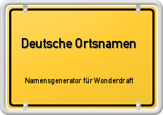

# Deutsche Ortsnamen

Name generator asset for Wonderdraft. Create realistic german names for your
settlements and cities.

With the release of version 1.0.0 there are 17,500 possible permutations.

## Installation

Follow the instructions at https://www.reddit.com/r/wonderdraft/wiki/assets/installingassets
or install via [Mythkeeper](https://cartographyassets.com/mythkeeper/).
